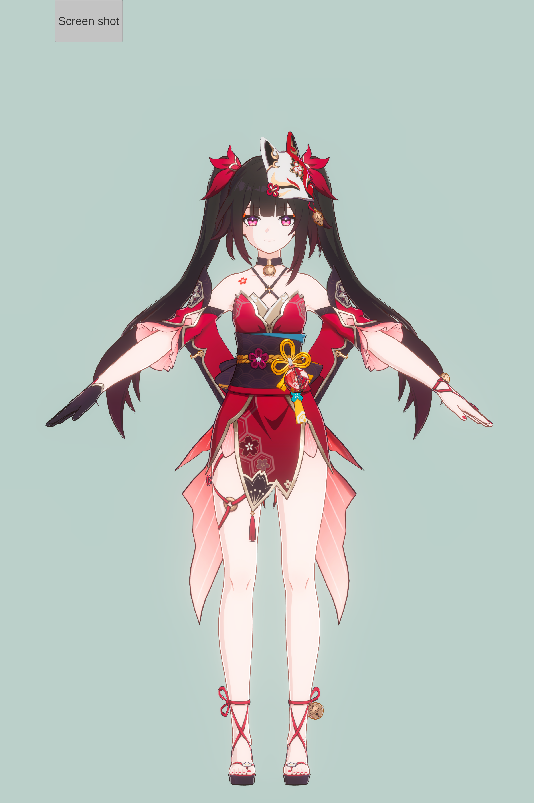

# Presentation

# Import
## To import the shader into your project, the unity version should be 2022.3.34 or later
1. Drag the unitypackage files into your project seperately.
2. Replace the texture in the inspector panel for each materials _(Assets > 0_SR > mar_7th)_
3. Import the character model, and apply the materials _(the eyebrow should be applied with the eye material)_ .
4. Choose volume from the imported files (The name is _MI Volume_)
5. Binding three empty objects _(Assume naming they as Center, Front, Right)_ with the character's head.Set the position of Center as (0,0,0),the position of Front as (0,0,A)  _(A could be any positive number)_, the position of Right as (B,0,0) _(B could be any nagetive number)_
###### the path of the head bone is showed in the follow img.

6. Attach the script _(Assets > 0_SR > SRLS2.1 > GetFaceDir.cs)_ to the character.Then drag the three empty objects and face/hair materials into the corresponding columns in the inspector panel.(Like the upper img)
##### The eye-through-the-hair effect and face SDF shadow depend on the facing direction vector.
7. Click _play_.(The _GetFaceDir.cs_ script wouldn't update the facing direction in edit mode when you are rotating your character.)

# Other Presentation

