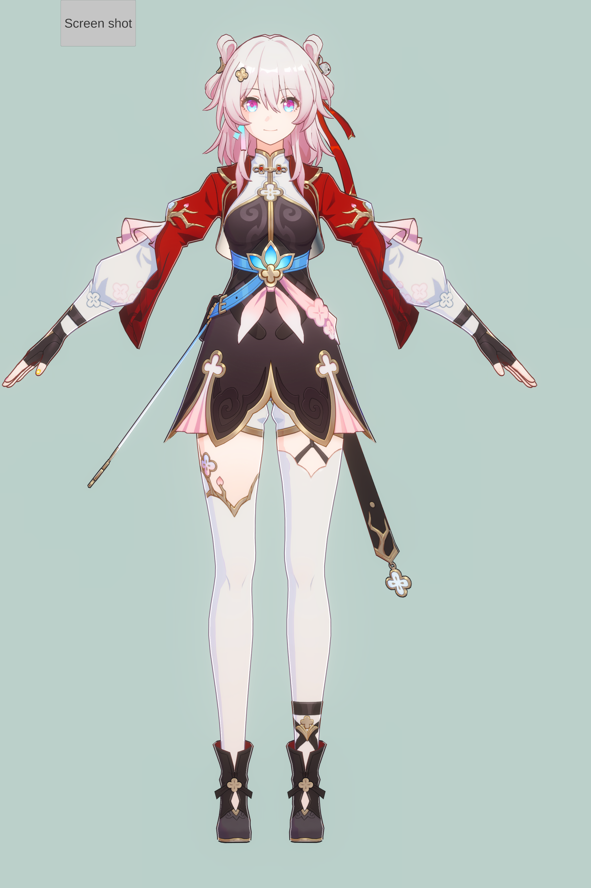
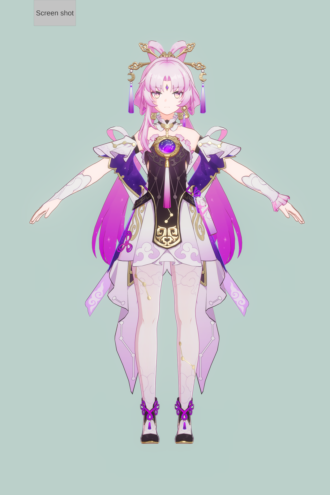
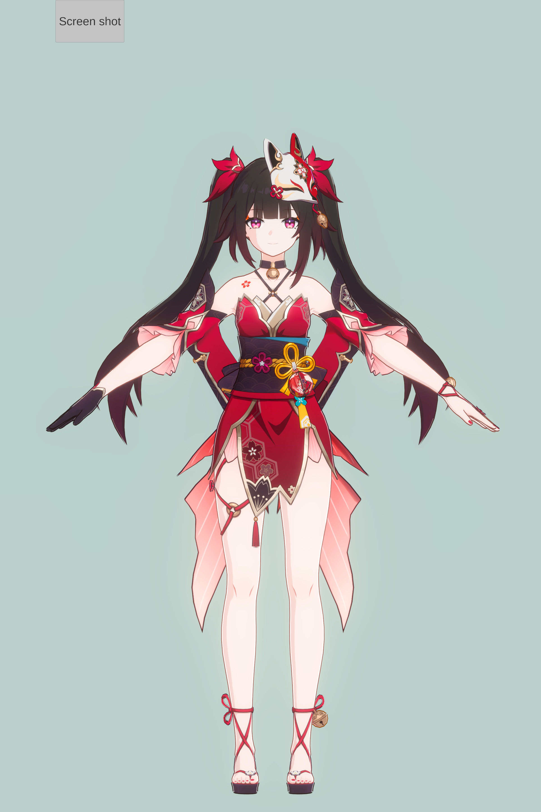
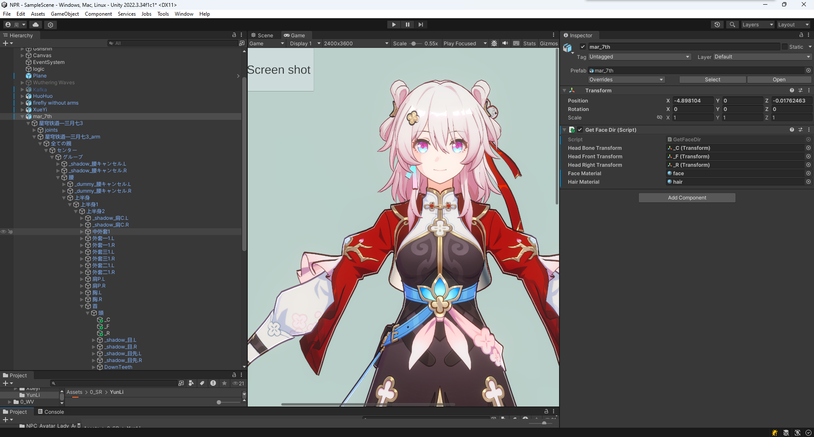
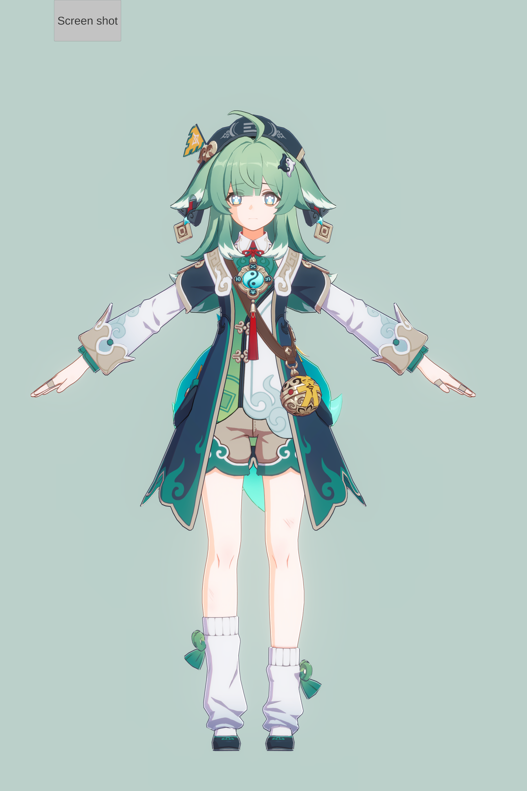
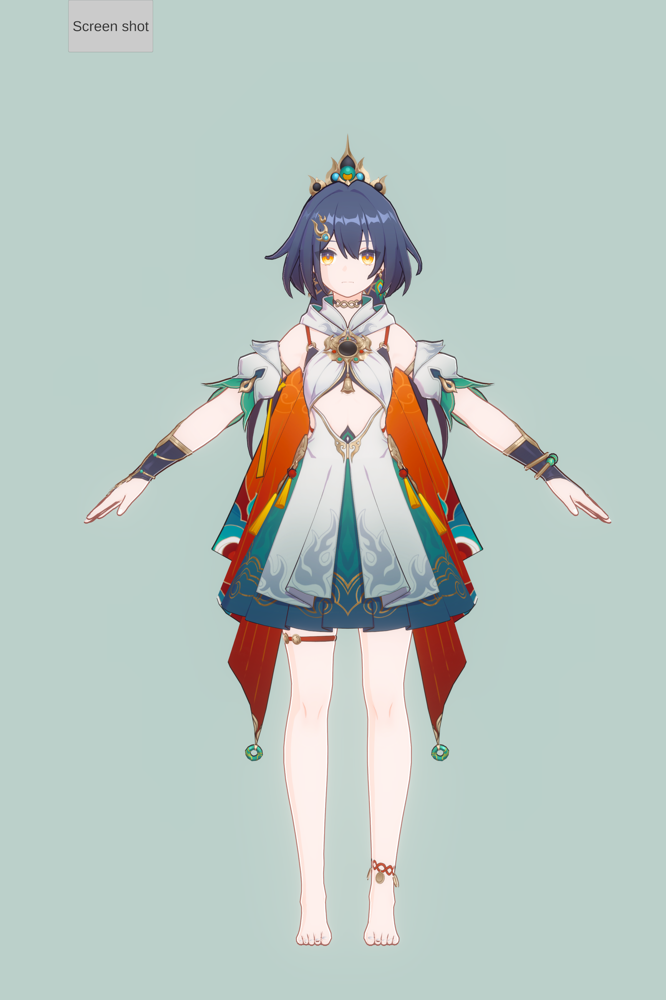
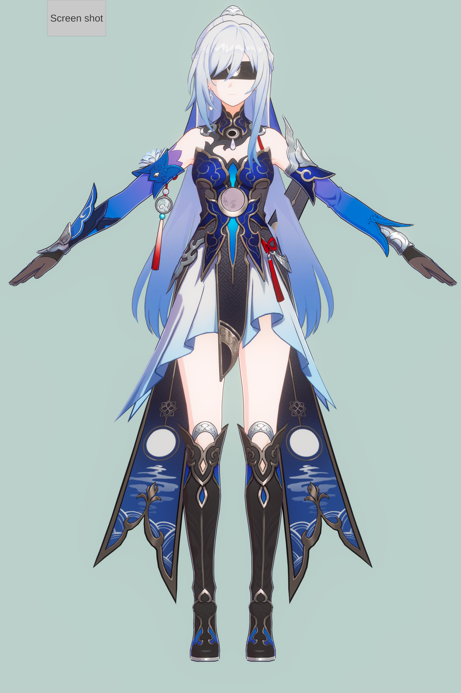
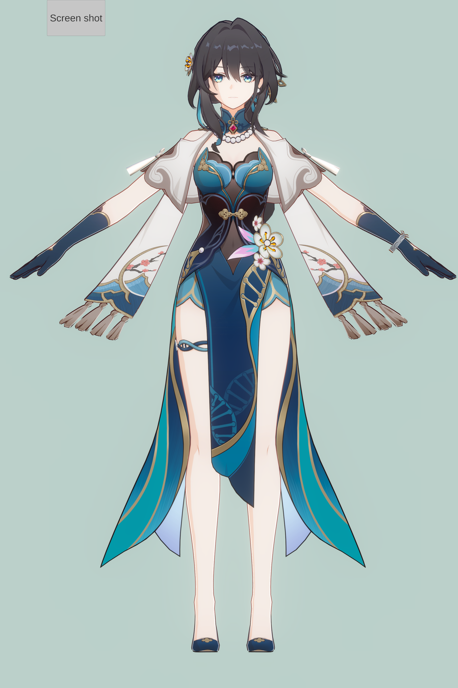
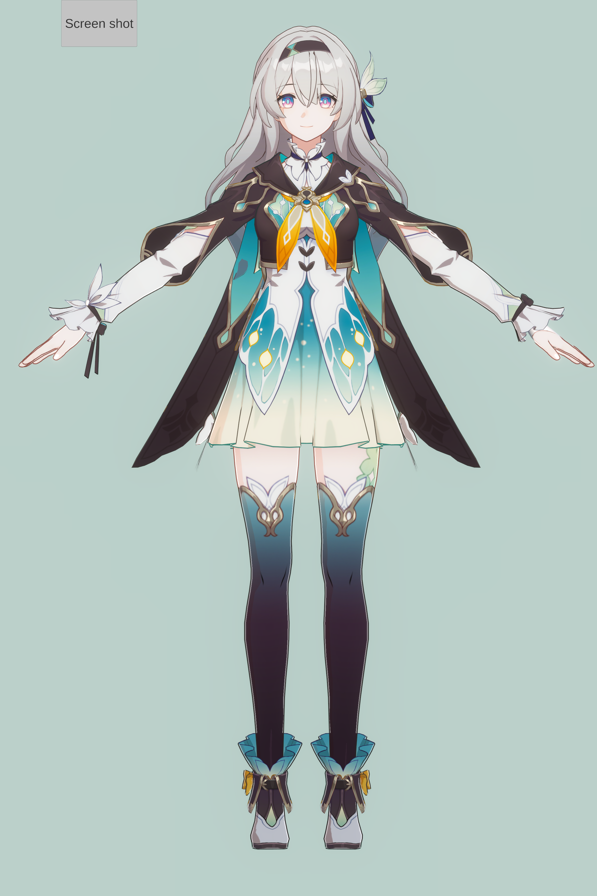
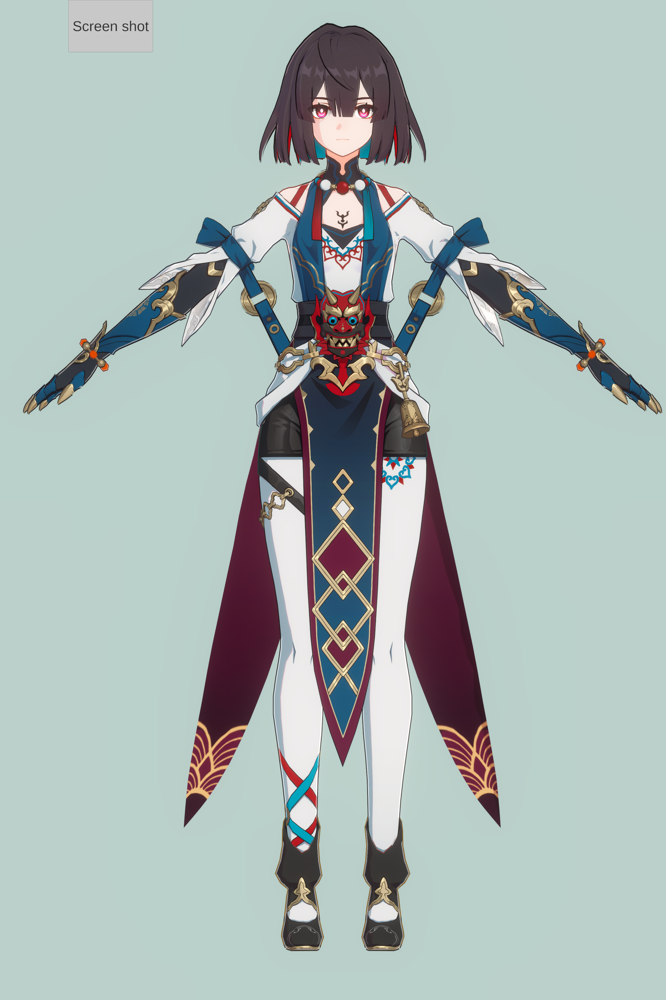

[中文](README.md)

# Presentation

# Updated Prefabs

You can now use the prefabs for the shaded characters directly, but you still need to import the _Settings.unitypackage_ and _Volume.unitypackage_ files from the _SRLS2.1.3_ folder.

You also need to apply the post-processing effect. In the Global Volume or Box Volume Inspector panel, select the corresponding volume file under `Volume -> Profile`. The file name is _MI Volume Profile_.

# Import

## To import the shader into your project, use Unity 2022.3.34 or later.

1. Drag the unitypackage files into your project separately.
2. Replace the textures in the Inspector panel for each material. The material path is _(Assets -> 0_SR -> mar_7th)_.
3. Import the character model and apply the materials. The eyebrow should use the same material as the eye.
4. In the Global Volume or Box Volume Inspector panel, select the corresponding volume file under `Volume -> Profile`. The file name is _MI Volume Profile_.
5. Bind three empty objects to the character's head. Assume they are named Center, Front, and Right. Set Center to (0,0,0), Front to (0,0,A), where A can be any positive number, and Right to (B,0,0), where B can be any negative number.

- The head bone path is shown in the following image.

6. Attach the script _(Assets -> 0_SR -> SRLS2.1 -> GetFaceDir.cs)_ to the character. Then drag the three empty objects and the face/hair materials into the corresponding fields in the script's Inspector panel, as shown above.

- The eye-through-hair effect and face SDF shadow depend on the facing direction vector.

7. Click _Play_. The _GetFaceDir.cs_ script does not update the facing direction in Edit Mode while you rotate the character.

# Other Presentations

